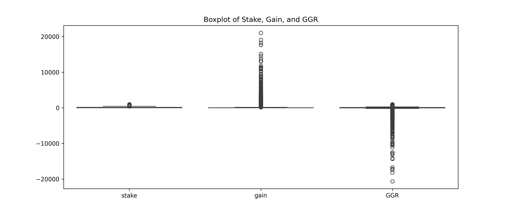
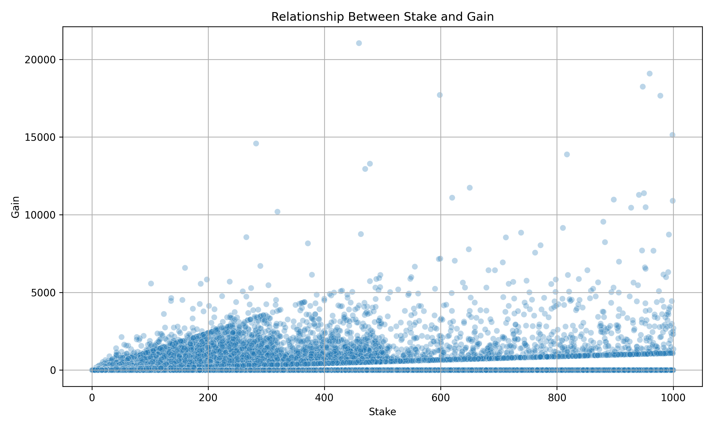

# 🧠 User Behavior Analysis in Sports Betting Platform

This project explores user behavior patterns based on 100,000 sports betting records.  
It is inspired by real-world use cases such as **Norsk Rikstoto's responsible gaming mission**.

---

## 🎯 Goal

To perform **exploratory data analysis (EDA)** on betting behavior and visualize patterns in user activity, stakes, and outcomes.

> ⚠️ **Note:** This is an exploratory project focused on data understanding.  
> No machine learning models were applied in this version.

---

## 📊 Visualizations

1. 📌 **Number of Bets per Sport**  
   

2. 📦 **Boxplot of Stake, Gain, and GGR**  
   

3. 🧪 **Scatter Plot: Stake vs Gain**  
   

---

## 📁 Project Structure

- `data/` → Raw dataset (excluded from GitHub via `.gitignore`)
- `notebooks/` → Jupyter notebooks for EDA
- `images/` → Charts used in README
- `README.md` → This file
- `.gitignore` → Ignores unnecessary files and data

---

## ✅ Current Status

- [x] Data loaded and parsed (`sep=';'`)
- [x] EDA completed with key charts
- [ ] ❌ No user segmentation or predictive modeling in this version

---

## 🔗 Data Source

- [Kaggle – Sports Betting Profiling Dataset](https://www.kaggle.com/datasets/emiliencoicaud/sports-betting-profiling-dataset)

---

## 🚀 Next Step (Optional, not planned)

- Clustering-based user segmentation  
- Churn prediction using ML  
- Responsible betting recommender system

---

## 📌 Summary

This project demonstrates practical **EDA skills**, data visualization, and behavioral insights, suitable for analytics and product-focused roles.
