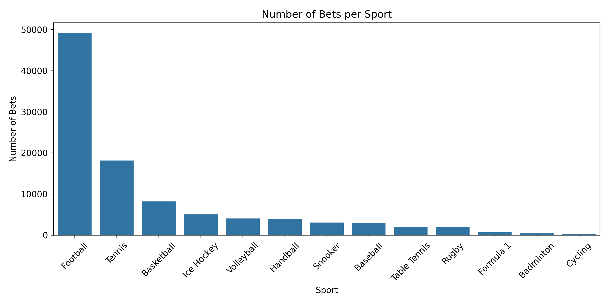

# 🎯 User Behavior Analysis in Sports Betting Platform

This project explores user behavior patterns based on 100,000 sports betting records.  
It is inspired by real-world use cases such as Norsk Rikstoto's responsible gaming mission.

## 🧪 Project Goal
To analyze betting behavior, explore user segmentation, and prepare data for churn prediction.

## 📂 Project Structure

- `data/` → Contains raw data (CSV), excluded from GitHub via `.gitignore`
- `notebooks/` → Jupyter notebooks for data exploration and modeling
- `README.md` → Project summary
- `.gitignore` → Excludes unnecessary files and data

## ✅ Current Progress

- [x] Data loaded and parsed correctly using `sep=';'`
- [x] Initial inspection with `.head()` and `.info()`
- [ ] EDA
- [ ] User Segmentation
- [ ] Predictive Modeling

---

## 📌 Notes

- Data source: [Kaggle – Sports Betting Profiling Dataset](https://www.kaggle.com/datasets/emiliencoicaud/sports-betting-profiling-dataset)
- The CSV file is large and excluded from this repository.
- 

  
